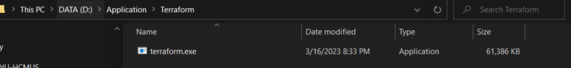
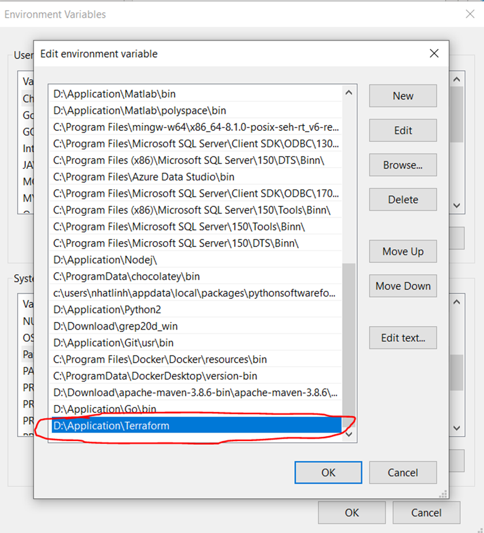

# Usege backend

## Prerequisites

### AWS setup
1. Download AWS Cli: [Download link](https://awscli.amazonaws.com/AWSCLIV2.msi)
2. Test installation:
   `aws -version`
3. Configure
```
aws configure --profile mobile_group_1_dev sso
```
Then insert
```
session name: mobile_group_1_dev
start URL: https://d-96677c108a.awsapps.com/star
region: ap-southeast-1
scopes: sso:account:access
```
4. Then, a webpage will ask you to login using the provided **dev** account (Teams)
```
region: ap-southeast-1
output format: json
profile name: mobile_group_1_dev
```
5. Run the command to check aws profile `aws s3 ls --profile mobile_group_1_dev`

### Terraform setup
1. [Download Terraform](https://developer.hashicorp.com/terraform/downloads?product_intent=terraform)
2. Insert the installed terraform folder to **PATH** environment
> 
> 
3. Run the command `terraform -v`

### First time initializing
1. Go to the [infrastructure/local](src/infrastructure/local) folder
2. Run the command to init terraform: `terraform init`
3. Run the command to plan change: `terraform plan`
4. Run [LocalStack](https://localstack.cloud/) on Docker (or using [docker compose file](docker-compose-local.yml) instead): `docker compose up -d`
5. Deploy terraform: `terraform apply --auto-approve`

### Run services after first time initializing
1. Just need to run Docker compose file: `docker compose up -d`